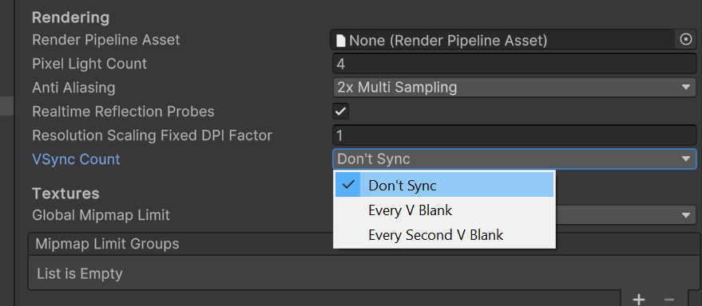

# Requirements

This page lists the Unity version and platform that the package supports.

## Unity Version

It is recommended to use the latest Long-Term Support (LTS) version of Unity, see [the post](https://blog.unity.com/technology/new-plans-for-unity-releases-introducing-the-tech-and-long-term-support-lts-streams) in Unity blog for LTS versions.

This version of the package is compatible with the following versions of the Unity Editor:

- **Unity 2020.3**
- **Unity 2021.3**
- **Unity 2022.3**
- **Unity 2023.1**

## Support Platform

- **Windows 10** (x64 only)
- **Linux** (Ubuntu 16.04, 18.04, 20.04)
- **macOS** (**Intel** and **Apple Slicon**)
- **iOS**
- **Android** (**ARM64** only. **ARMv7** is not supported)

## Additional Notes

Please note that there are unsupported platforms below.

- **Windows UWP** platform is not supported.
- Building for **iOS Simulator** is not supported.
- **WebGL** platform is not supported.

### Build on Android

To build the apk file for **Android platform**, you need to configure player settings below.

- Choose **IL2CPP** for **Scripting backend** in Player Settings Window.
- Set enadle **ARM64** and Set disable **ARMv7** for **Target Architectures** setting in Player Settings Window.
- Choose **Require** for **Internet Access** in Player Setting Window.

> [!NOTE]
> Set disable **Optimized Frame Pacing** in Player Settings Window. ( Known issues https://github.com/Unity-Technologies/com.unity.webrtc/issues/437)

### Build on iOS

You must disable the bitcode option in Xcode project exported from Unity.

- On the Xcode **Build Settings** tab, in the **Build Options** group, set Enable Bitcode to **No**.

Or refer to the Unity Support's answer. https://support.unity.com/hc/en-us/articles/207942813-How-can-I-disable-Bitcode-support-

## Known Issues

- You might be able to find your issue in [GitHub Issues](https://github.com/Unity-Technologies/com.unity.webrtc/issues).
- It is possible to get the framerate of video streaming to be drastically low when using Vulkan API Linux and Android. Please set **Don't Sync** in the Quality Settings Window.

